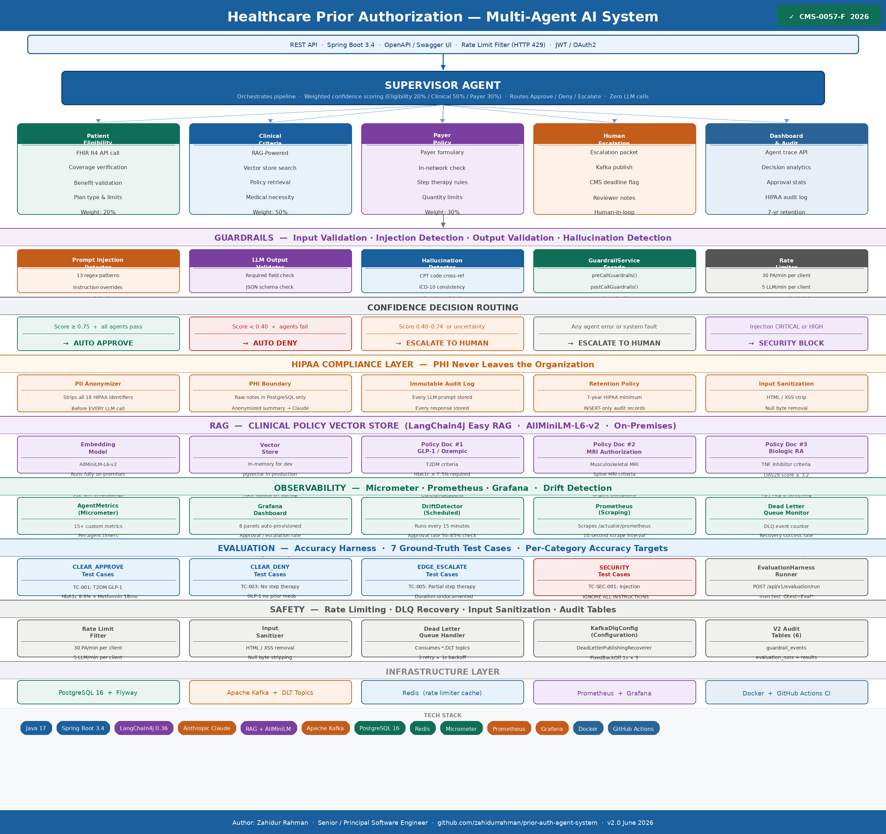

# Healthcare Prior Authorization — Multi-Agent AI System

> Production-grade multi-agent AI pipeline for prior authorization  
> aligned with the **CMS-0057-F federal mandate (2026)**  
> Built with Java 17 · Spring Boot 3.4 · LangChain4j · Anthropic Claude

---

## Architecture

---

## What This System Does

Prior authorization is a healthcare administrative process where doctors
must get insurance approval before treating patients. The CMS-0057-F rule
mandates **72-hour urgent** and **7-day standard** electronic response by 2026.

This system automates the full PA pipeline using 5 specialized AI agents:

| Agent | Role | Technology |
|---|---|---|
| Patient Eligibility Agent | Verifies insurance coverage | FHIR R4 + Claude |
| Clinical Criteria Agent | Validates medical necessity | RAG + LangChain4j + Claude |
| Payer Policy Agent | Checks formulary and step therapy | Claude |
| Human Escalation Agent | Routes uncertain cases to humans | Kafka + Claude |
| Dashboard & Audit Controller | Full decision trace and analytics | Spring Boot |

---

## Four Production Pillars

### Guardrails
- Prompt injection detection (13 patterns — CRITICAL to LOW severity)
- LLM output schema validation (required fields, confidence range, boolean types)
- Hallucination detection (CPT/ICD-10 cross-reference, policy document validation)
- Rate limiting (30 PA/min per client, 200 LLM calls/min global)

### Observability
- 15+ Micrometer custom metrics exposed to Prometheus
- Grafana dashboard (8 panels: approval rate, agent latency, confidence distribution, guardrail triggers)
- Automated drift detection (scheduled every 15 minutes)
- CMS deadline monitoring (alerts 4 hours before 72hr breach)

### Evaluation
- 7 ground-truth test cases across 4 categories
- Accuracy targets: 90% clear approve, 95% clear deny, 100% security block
- Before/after comparison harness for prompt engineering
- REST endpoint: POST /api/v1/evaluation/run

### Safety
- Input sanitization (HTML/XSS, null bytes, clinical code format validation)
- Kafka Dead Letter Queue with database recovery fallback
- HIPAA: PII anonymized before every Claude API call
- Immutable audit log — 7-year retention per HIPAA

---

## Tech Stack

| Layer | Technology |
|---|---|
| Language | Java 17 |
| Framework | Spring Boot 3.4 |
| Agent Orchestration | LangChain4j 0.36 |
| LLM | Anthropic Claude (claude-sonnet-4-6) |
| RAG / Embeddings | LangChain4j Easy RAG + AllMiniLM-L6-v2 |
| Messaging | Apache Kafka + Dead Letter Topics |
| Database | PostgreSQL 16 + Flyway migrations |
| Caching | Redis |
| Metrics | Micrometer + Prometheus |
| Dashboards | Grafana (auto-provisioned) |
| Containerization | Docker + Docker Compose |
| CI/CD | GitHub Actions |

---

## Compliance

| Requirement | Implementation |
|---|---|
| HIPAA PHI Protection | PII stripped before every LLM call |
| HIPAA Audit Trail | Immutable agent_audit_logs, 7-year retention |
| CMS-0057-F 72hr Urgent | Priority field + deadline scheduler |
| CMS-0057-F Electronic PA | Full REST API + FHIR R4 integration |
| HL7 FHIR R4 | CoverageEligibilityRequest/Response format |

---

## Documentation

📄 [Full Technical Walkthrough](docs/prior-auth-walkthrough-v2.pdf)  
Covers: What · How · Why · Interview Q&A · Glossary · File Reference

---

## Author

**Zahidur Rahman**  
Senior / Principal Software Engineer  
15+ years in distributed systems, platform engineering, enterprise Java  
Healthcare domain: Florida Blue (BCBS), Liberty Mutual  

---

> *Source code is maintained in a private repository.*  
> *This showcase repository contains architecture, documentation, and diagrams only.*
